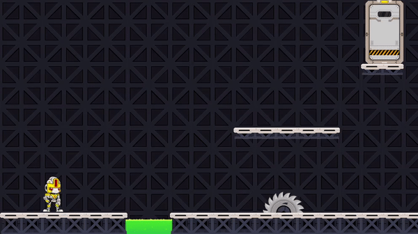
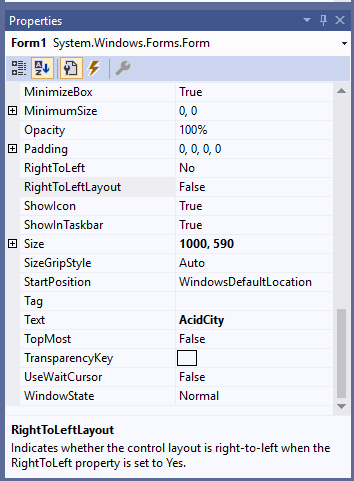
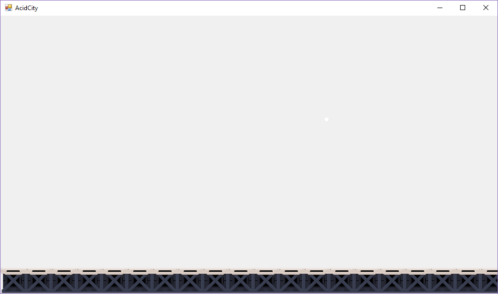

# Platformer játék

A feladat egy platformer játék létrehozása. Ahol egy robottal kell eljussunk a célba, kikerülve az akadályokat.



## Projekt lérehozása

Egy windows forms app (.NET Framework) projektet hozz létre, ez létre is hozza az ablakot amin dolgozni fogunk.
Ha elindítjuk a programot a zöld háromszöggel, akkor meg is jelenik az ablak, csak még nincs rajta semmi.
Még az ablak neve form1, ezt látjuk a jobb felső sarokban. Ezt úgy tudjuk átnevezni, ha a Visual Studio jobb alsó sarkában lévő properties fülön átállítjuk a Text tulajdonságot.
Mondjuk nevezzük át "AcidCity"-re. Indítsd el a programot és ellenőrizd le, hogy sikerült lecserélni a form1 feliratot.



## Képek hozzáadása

Ebben a mappában több ingyenesen elérhető képet találsz, amit fel tudunk használni a platformer játékunkhoz. Képet úgy tudunk hozzáadni játékunkhoz, ha Project menüben a Properties 
menüpontra kattinva megnyitjuk a projekt tulajdonságait. Itt a resources fülre kattintunk.
Itt fognak megjelenni a játékhoz használt képek. Képet úgy tudunk hozzáadni, ha az Add Resource gomb mellé a lefele nyílra kattintunk, azon belül az add existing file opcióra, és kiválasztjuk a hozzáadni kívánt képet.
Add hozzá a `ground_full.png`-t a projekthez!

## Képek kirajzolása.

Menjünk vissza a Form1 [Design] -ra a Visual Studioban. Jobb oldalt a propertiesben kattintsunk a villámra. Majd keressük ki a Paint opciót és kattintsunk rá duplán. Ekkor megnyit egy c# fájlt
a Visual Studio. Itt fogjuk a játékunk kódját írni.

Az Form1_Paint függvénybe írd be az alábbi kódot:

```cs
  Bitmap ground_full = platformer.Properties.Resources.ground_full; //Beolvassuk a Resource-ba betett képünket a grass_full változóba
  e.Graphics.DrawImage(grass_full, 30, 30, 50, 50);               //Kirajzoljuk a képet a balról 30 és felülről 30 pixelre.
                                                                  //A képet kirajzolás előtt 50x50 pixelre méretezzük át.
```
Futtasd le a programot, ellenőrizd tényleg megjelent-e a kép. Majd módosít módosítsd úgy a kódot, hogy balról 100 felülről 200 pixelre jelenjen meg. Ellenőrizd az eredményt.

___Hasznos infó___: A képernyő koordináta rendszere eltér a matek órán tanulttól. Mivel ennek origója (középontja) a képernyő bal felső sarka. Az x koordináta balról jobbra, míg az y fentről lefele nő.

## Ablak átméretezése

Méretezd át az ablakot úgy, hogy 1000x590 pixel nagyságú legyen.
Ezt úgy tudod megtenni, ha a design fülön a properties ablakba mész, itt ha véletlen a villám lenne aktív, akkor átkattintasz a villáskulcs van. Ezután kikeresed a Size tulajdonságot, és átállítod.

## Föld kirajzolása

Módosítsd úgy a kirajzolást, hogy egész szélességében legyen platform a képernyő alján.



## Robot kirajzolása

A robot_idle képet a töltsd be a resource-ok közé, majd jelenítsd meg ezt is a platform tetején állva.

## Robot mozgása

Először a robot egyenletesen fog jobbra haladni. Ehhez ahogy telik az idő, változtatnunk kell mit rajzolunk ki. Ezt úgy tudjuk megtenni, hogy megkérjük a rendszert, hogy kis időnte szóljon nekünk,
hogy telik az idő, újra kell rajzolni a képet. Ezt úgy tudjuk megtenni, ha létrehozunk egy timert.

Timert úgy tudunk létrehozni ha a [Design] fülön a bal oldali Toolbox ablakban megkeressük a timert, és AcidCity ablakunkra húzzuk azt. Ezután a timer1-re (ez a létrejött timerünk)
kattintva a properties ablakban tudjuk állítani a tulajdonságait. Engedélyezzük a timert (ha nem engedélyezzük, akkor nem szólna nekünk, hogy telik az idő), ezt az Enable tulajdonság true-ra állításával tudjuk megtenni.
Majd állítsuk be, hogy az interval azaz, hogy hány millisecundumonként szól nekünk a timer, az legyen 10. Végül a villámra kattintsunk, és itt kattinsunk duplán a Tick-re.
Ennek hatására megint a forráskódhoz jutunk vissza, de már itt a timer1_Tick függvény. A timer ezt a függvényt minden 10 ms-ben meg fogja hívni.
A robot mozgatásához itt minden tickben kicsit növelnünk kell (mondjuk 2 pixellel), azt, hogy hol álljon a robot, majd a megfelelő pozícióba ki kell rajzoljuk a robotot, a form1_Paintben.
Emellett a Tick függvény végén hívjuk meg az Invalidate() beépített függvényt. Ezzel tudjuk jelezni, hogy újra kéne rajzolni az ablakot, mivel változott a játékunk képe.

## Robot mozgatása a nyilakkal

A nyilakkal való mozgatáshoz érzékelnünk kell először is a billentyűleütéseket. Ehhez a [Design] oldalon a form1-re kattintva megint a properties ablakra megyünk. A villám legyen kiválasztva.
Itt keressük ki a KeyDown eseményt, hiszen erre akarunk feliratkozni, hogy hívja meg a rendszer a függvényünket, ha billentyűleütés történt. Kattintsunk duplán a KeyDownra. Ekkor létrehozza a Visual Studio a Form1_KeyDown függvényt.

Ezután meg kell kérdezzük a rendszert, hogy a felhasználó melyik gombot nyomta le. Pl. azt, hogy a balra nyíl lett e lenyomva így tudjuk megkérdezni:
```cs
if(e.KeyCode==Keys.Left){
  //Csináld ezt...
}
```

Csináld meg, hogy ha a jobbra, vagy a balra nyilakat nyomja meg a felhasználó, akkor változtassa a robot, hogy melyik irányba halad.

## Robot forgatása

Bár a robot mostmár tud jobbra haladni, de még hátrál és nem megfordul. Úgy tudjuk megfordítani a robotot, ha a robot képét, amit kirajzolunk tükrözzük.

Képet tükrözni az alábbi módon tudunk:

```cs
img_robot.RotateFlip(RotateFlipType.Rotate180FlipY); //img_robot a változó, amibe a robot képét betöltöttük
```

## Pálya széle

Végül egészítsd ki a kódot, hogy ha a robot eléri a pálya szélét, akkor álljon meg, és ne menjen abba az irányba.
