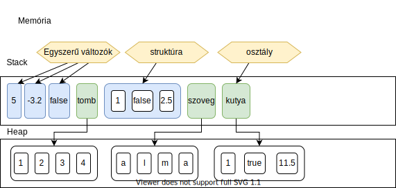
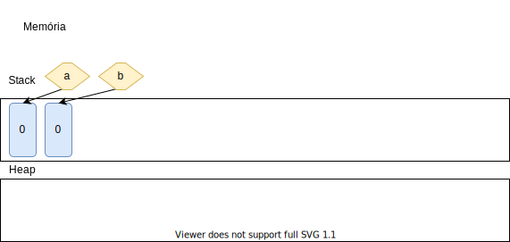
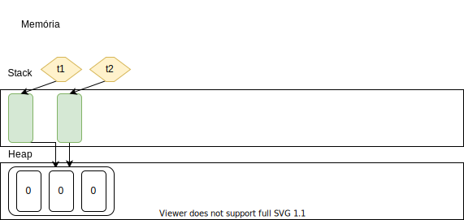

# Referencia és érték típus (class vagy struktúra)

A C#-ban kétféle változó típus van. A referencia és az érték. A kettő közötti különbség, hogy az értéket úgy képzelhetjük el, mint, ha az a memóriában közvetlenül foglalna helyett,
az referenciát meg úgy, mintha az valahol egy másik nagyobb memóriában lenne, nekünk meg csak egy mutatónk van, hogy hol találjuk azt.



A fenti ábrán látszik, hogy néz ki a programunk memóriája. A stack (verem/statikus memória)-ben vannak a kis változók, oda nagy dolgokat nem szoktunk rakni. Míg a heap (dinamikus memória) vannak azok a váltózók amik nagyobbak. Viszont programunk közvetlenül csak a stack-en találja meg a dolgokat, a heapen nem. Így a stack-en vannak kis mutatók, amik jelölik, hogy hol keresse a a hosszabb adatokat a heap-en a program. Az ábrán kékkel jelöltem azokat a változókat, amik a stack-en vannak, és zölddel, amikor csak egy mutató van, hogy hol kell keresni az adatot.

Összefoglalva, itt van, hogy mi referencia és mi értéktípus C#-ban:

típus | érték | referencia
---|---|---
int | :heavy_check_mark: | |
double | :heavy_check_mark: | |
bool | :heavy_check_mark: | |
char | :heavy_check_mark: | |
string |  | :heavy_check_mark: |
tömb |  | :heavy_check_mark: |
struct | :heavy_check_mark: |  |
class | | :heavy_check_mark: |

__Érték típusok__ legfontosabb jellemzője, hogy a program mindig másolja az egész adatot.
Vegyük az alábbi kódod:
```cs
int a=0;
int b=a;
```
Itt a b-be lemásolta az a-nak a tartalmát, a memória így néz ki:



Azaz, ha b-t módosítjuk, akkor a változó nem fog változni.

A __referencia típusok__ esetén másoláskor, viszont csak a mutatónk, referenciánk fog másolódni, a tényleges adat nem.
Vegyük az alábbi kódot:
```cs
int[] t1=new int[3];
int[] t2=t1;
```
Itt csak a mutatót másoljuk le, a teljes tömböt nem. A memória így néz ki:


Azaz, ha t2 egyik elemét megváltoztatjuk, t1 is meg fog változni.

Az is előfordulhat, hogy egy referencia típus mutatója még nem mutat sehova. Ekkor `null` az értéke:
```cs
int[] t1=null;
```
Később persze megadhatjuk hova mutasson majd t1.


## 1. feladat
Hozz létre új projektet, másold be e az alábbi kódot (a Main függvénybe), és futtasd le!

```cs

int a=1;
int b=2;
Console.WriteLine($"a={a}, b={b}");
b=a;
Console.WriteLine($"a={a}, b={b}");
a=5;
Console.WriteLine($"a={a}, b={b}");

```
Mit tapasztalsz? Hogyan magyarázod az eredményt?

## 2. feladat
A következő kódhoz hozd létre az alábbi segédfüggvényt:
```cs
static void TombKiir(int[] a, int[] b){
  Console.WriteLine("a tömb:");
  Console.WriteLine($"\t hossza: {a.Length}");
  Console.Write("\t elemei:");
  for(int i=0;i<a.Length;i++){
    Console.Write($" {a[i]}");
  }
  Console.WriteLine();
  
  Console.WriteLine("b tömb:");
  Console.WriteLine($"\t hossza: {b.Length}");
  Console.Write("\t elemei:");
  for(int i=0;i<b.Length;i++){
    Console.Write($" {b[i]}");
  }
  Console.WriteLine();
}
```
A függvény beillesztése után vizsgáld meg az alábbi kódot:
```cs

int[] a=new int[1];
a[0]=2;
int[] b=new int[2];
b[0]=1; b[1]=-1;
TombKiir(a,b);
a=b;
TombKiir(a,b);
a[0]=4;
TombKiir(a,b);
b[0]=4;
TombKiir(a,b);

```
Mit tapasztalsz?

## 3. feladat
Mikor függvénynek átadsz egy változót, hasonlóan az értékváltozók lemásolódnak, a referencia típusú változóknál csak a mutató másolódik le, az adat nem.

Teszteld le az alábbi függvény működését:
```cs
static void TesztFn(int a, int[] tomb){
  a++;
  for(int i=0;i<tomb.Length;i++){
    tomb[i]++;
  }
}
```
Mit figyelsz meg?

## 4. feladat
Az osztályok és a struktúrák között is ez az egyik legalapvetőbb különbség. A struktúra értéktípus, azaz mindig másolódik az adat is, míg az osztály referencia típus, így ott az adat nem másolódik, csak a mutató.

Hozd létre az alábbi struktúrát:
```cs
public struct Ido{
  public int Ora;
  public int Perc;
  public int Masodperc;
  
  public void Kiir(){
    Console.WriteLine($"Idő: {Ora}:{Perc}:{Masodperc}");
  }
}
```
Írj a `class Program`-ba `Tick` nevű függvényt. A függvény egy Ido struktúrában tárolt időpontot növeljen egy másodperccel. Teszteld is a függvényt!

## 5. feladat
Módosítsd az idő struktúrát, idő osztályra. Írd meg úgy a `Tick` függvényt, hogy ne legyen visszatérési értéke, a másodperc ennek ellenére növekedjen.

## 6. feladat

Vizsgáld meg az alábbi kódot:

```cs
Ido ido;
ido.Ora=0;
ido.Kiir();
```
Mi a hiba? Javítsd ki a kódot, hogy jól működjön.

## Bónusz feladat
Ha tudsz elég jól angolul és mélyebben érdekel a téma, akkor olvasd el az alábbi [cikk](https://www.c-sharpcorner.com/UploadFile/ff2f08/ref-vs-out-keywords-in-C-Sharp/)et és próbáld a 4. feladatot megírni a `ref` kulcsszó felhasználásával.
