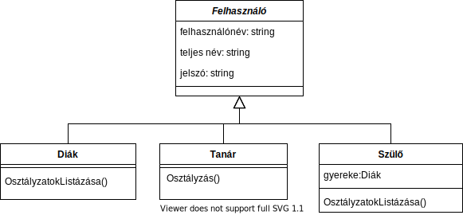
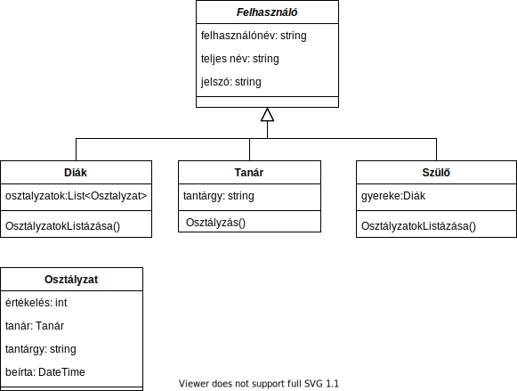

# Öröklés

Előfordul, hogy annyira sok osztályunk van, hogy csoportosítani, hierarchiába szeretnénk őket rendezni, a közös tulajdonságokat kiemelni és csak egyszer megvalósítani.
Egy nagyobb programozási projekt akár több száz osztályt is tartalmazhat, ezek megfelelő csoportosítás nélkül kezelhetetlenek lehetnek.

Az öröklés a fenti problémára ad megoldást, létrehozhatunk a közös tulajdonságok tárolására ősosztályokat, amiből leszármazhatnak a közös tulajdonsággal rendelező osztályaink.

Például szeretnénk e-naplót írni. Az e-naplóba diákok és tanárok illetve szülők léphetnek be. Minden diáknak tanárnak, szülőnek saját felhasználóneve és jelszava van. De míg a tanárok
beírhatnak osztályzatokat a diákoknak, a diákok csak megtekinthetik a saját osztályzataikat, a szülők meg csak a gyerekeik osztályzatait tudják megtekinteni.

Legyen a tanároknak, diákoknak, szülőknek egy közös ős osztálya a felhasználó. A felhasználó rendelkezzen felhasználónévvel és jelszóval, de ne rendelkezzen jegybeírás funkcióval, hiszen a szülők, diákok nem tudnak jegyeb beírni.

Az alábbi ábra összefoglalja, a létrehozandó osztályainkkat, és azok tulajdonságait:



Az ábra egy úgynevezett osztálydiagram. Ahol a dobozok az egyes osztályokat jelölik. A dobozt vízszintes vonalak három részre bontják. Az első részben az osztály neve található. A második részben az osztály tagváltozói. A harmadik részben meg a tagfüggvényei. Azaz például a felhasználónak van 3 string típusú változója: teljes név, felhasználónév és jelszó. A diáknak csak egy tagfüggvénye van: osztályzatok_listázása(). Az üres fejű nyíl az öröklést jelöli. A nyíl az ősosztály felé mutat a leszármazottól. Az ábrán mindhárom a diák a szülő és a tanár osztály is a felhasználóból származik le.

Egyenlőre feltételezzük, hogy minden szülőnek pontosan egy gyereke jár az iskolába.

## 1. feladat

Hozd létre a három osztály, hozd létre a tagváltozókat, a tagfüggvényeket, de a tagfüggvények belsejét még ne írd meg, csak hozd létre.

Segítségként a diák osztálynak így kéne kinéznie:

```cs
class Diak: Felhasznalo{ // kettőspont után tudjuk megadni melyik osztályból származik le az osztályunk (ha van ilyen).
  void OsztalyzatokListazasa(){
    //még nem csinál semmit.
  }
}
```

## 2. feladat

Hozz létre a felhasználó osztályban `JelszoModositasa(string regi_jelszo, string uj_jelszo)` függvényt. A függvény módosítsa a felhasználó jelszavát az új jelszóra, ha a régi jelszó megegyezik a `jelszo` tagváltozóban tárolt változóval.

Ez a függvény innentől minden felhasználónál meg fog jelenni, azaz a tanároknál, a diákoknál és a szülőknél is. Teszteléshez hozz létre a Main függvényben egy diákot "Nagy Károly" névvel, legyen a felhasználóneve "nagykarcsi01" jelszava meg "jelszo123" legyen. Majd a hívd meg a JelszoModositasa() függvényt.

## 3. feladat

Hozz létre a Felhasznalo osztályban konstruktort. A konstruktor a teljes nevet, a felhasználó nevet, és a jelszót fogadja bemeneti paraméterként.

A kontruktor létrehozása után hibát jelez a másik három osztályban a visual studio. Mi lehet a hiba oka? Próbáld megindokolni.

Javítsd is ki a hibát. Segítséget [itt](https://docs.microsoft.com/en-us/dotnet/csharp/language-reference/keywords/base#example-1) találsz. A szülő konstrultora fogadjon egy diákot, is, akinek a szülője.

Módosítsd a teszt diák létrehozását, hogy mostmár a konstruktort használd hozzá. Teszteld is le a munkád!

## 4. feladat

Az osztályzatokat, amiket a tanár beír valahogy el is kellene tárolni. Ehhez hozz létre az `Osztályzat` osztályt. Az osztálydiagram segít abban, hogy hogy nézzen ki ez az osztály:



Az ábrán látható módon egészítsd ki a tanár és a diák osztályt is. Minden tanárnál eltároljuk, hogy milyen tárgyat tanít. (Feltesszük, hogy minden tanár pontosan egy tantárgyat tanít.) Illetve a diáknál eltároljuk, hogy milyen osztályzatokat szerzet. Módosítsd a konstruktorokat is a változásoknak megfelelően!

## 5. feladat

Vedd fel az `Osztály` nevű osztályt. Az osztálynak legyen neve (mondjuk "9.a"), tartalmazzon egy listát az osztályban található diákokból, a tanárok meg tároljanak egy listát, arról melyik osztályokban tanítanak.

## 6. feladat

Írd meg az `Tanár.Osztályzás(string osztalynev, string diaknev, int osztalyzat)` függvényt. A függvény a bemeneti paraméterek alapján határozza meg, kinek kell az osztályzatot adni, majd, adja hozzá az osztályzatot a diák osztályzataihoz. (Felteheted, hogy egy osztályban nincs két azonos nevű tanuló).

## 7. feladat

Írd meg a `Diák.OsztalyzatokListazasa` függvényt. Az alábbi formátumban írja ki a konzolra a diák osztályzatait:

```
diák: Nagy Károly
-----------------
Matematika: 5 1 1 2 5 4
  átlag: 3.0
Fizika: 2 3
  átlag: 2.5
Magyar: 5 5 5 5 5 5 5 3 5
  átlag: 4.8
Testnevelés: 2 5 5 3 2
  átlag: 3.4
```

## 8. feladat

Írd meg a `Szülő.OsztályzatokListazasa` függvényt, mai kiírja a szülő gyerekének eredményeit. A függvény használja fel a 7. feladatban megírt függvényt!

___Extra feladat___: Módosítsd úgy a szülő osztályt, hogy több gyerekei is lehessen a szülőnek, mindegyik gyerekének írja ki az osztályzatok listázása az eredményét.

## 9. feladat

A main függvényben hozz létre egy tesztiskolát, tesztosztályokkal, teszttanárokkal, és tesztszülőkkel. Majd a teszttanárok osztályozzák a teszttanárokat, végül hívd meg egy tetszőleges tesztszülő OsztályzatokListazasa függvényét. (A tesztfelhasználókhoz létrehozhatod for ciklusokkal is.)

