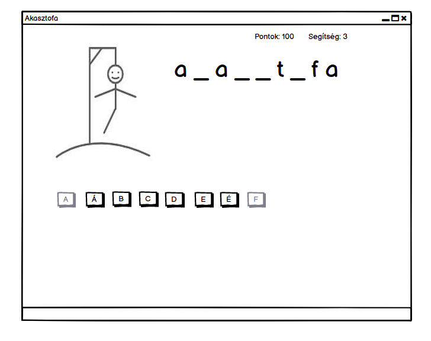

# Akasztófa

A feladat egy akasztófa játék írása lesz. A felhasználó feladata magyar nyelven szavak kitalálása, próbálkozhat az abc különböző betűivel.
Ha eltalálja a betűt nem veszít az életeiből, de ha nem szerepel a betű a kitalálandó szóban akkor veszít az életeiből. Ha az összes élete elfogyott akkor elveszti a játékot. (A felületterven csak F-ig vannak a betűk, de persze az összes betű szerepel majd a kész programban).




## 1. feladat: Felület
Hozz létre egy Windows Forms projektet. A felületen legyen egy kép (PictureBox) ahol az akasztófát tudjuk majd megjeleníteni.
Egy szövegdoboz (TextBox), ahol majd megjelenítjük a kitalálandó szót (aláhúzással a még nem ismert betűket). Illetve az ABC betűinek megfelelő gombokat.

A szövegdobozt és a képet ráhúzhatod a designerben az ablakra, viszont mind az összes ABC betű gomb kézzel hozzáadása sok idő lenne. Ezért inkább megéri ezt programmal csinálni. Ehhez segítséget nyújtanak az alábbi kódrészletek:

``` cs
//ez a tömb sorban a magyar abc betűit tartalmazza (duplamássalhangzók nélkül), ezt felhasználhatod a kódban
string[] abc_betui=new string[]{"A", "Á", "B", "C", "D", "E", "É", "F", "G", "H", "I", "Í", "J", "K", "L", "M", "N", "O", "Ó", "Ö", "Ő", "P", "R", "S", "T", "U", "Ú", "Ü", "Ű", "V", "Z"};


//Egy új gomb hozzáadása az ablakhoz:
Button betu=new Button(); //Létrehozunk egy új gombot
betu.Text="A" //gomb szövege
betu.Left=100 //gomb vízszintes helyzete
betu.Top=100  //gomb függőleges helyzete
this.Controls.Add(betu); //Hozzáadjuk a gombot az ablakhoz
```

## 2. feladat: Kitalálandó szó I.
Készíts egy txt-t, aminek minden sorában egy-egy magyar szó van. A program indulása után olvasd be ezt a txt, és hozz létre egy string tömböt (globális változóként: a From1 classba, de a függvényeken kívülre), amiben a beolvasott szavak vannak.

Véletlenszerűen sorsolj egy új kitalálandó szót (ezt is mentsd el egy globális változóba)! Segítség a véletlenhez:
```cs
//Véletlenszám generálás 
Random random=new Random(); //véletlenszámgeneráló
int veletlenszam=random.Next(0,10); //generál egy 0-nál nagyobb vagy egyenlő és egy 10-nél szigorúan kisebb számot.
```
Hozz létre egy a bool tömböt (globális változóként), ami aminek hossza egyezzen meg a szó hosszával. Itt minden mező azt tárolja majd, hogy az adott karaktert kitalálták-e már vagy sem.

## 3. feladat: Kitalálandó szó II.

Írj egy függvényt, ami a kitalálandó szó és a bool tömb alapján létrehozza a felhasználónak megjelenítendő szöveget.

A függvény először hozzon létre egy olyan szöveget, ahol, ha a betűre már tippeltek, akkor az adott betűt jeleníti meg, különben _ jelet. Végül állítsa be, hogy a TextBox-ban megjelenjen ez a szöveg.

Hívd meg ezt a függvényt a program futásának elején, ha mindent jól csináltál annyi aláhúzás fog megjelenni ahány betű a szó.

## 4. feladat: betűk találgatása
Hasonlóan az eddigiekhez, most is csinálunk egy Button_Click függvényt, amibe leírjuk, hogy mit csináljon a program, ha rányomtak az egyes betűkre. Viszont most
nem a grafikus felületen fogjuk beállítani, hogy mikor hívódjon meg a függvény, mivel a gombokat nem a grafikus felületen hoztuk létre.

A írd meg a függvényt a korábbi button_click függvények mintájára. A függvény módosítsa a bool tömböt, ha a betű amire a felhasználó kattintott szerepel a szóban.
Ezután frissítse a TextBoxban megjelenő szöveget (ehhez használhatod a 3. feladatban megírt függvényt). Végül tegye megnyomhatatlanná (disabled a gombot).

Segítségek:
```cs
  //Így érjük el, hogy melyik gombot nyomta meg a felhasználó, a clickeButton a megnyomot gombot tartalmazza
  Button clickedButton = (Button)sender;
  
  // így tesszük megnyomhatatlanná a gombot
  clickedButton.Enabled=false;
 ```
 
 Végül még hozzá kell adnunk az Button_Click függvényt be kell állítsuk, hogy az hívódjon meg, ha a felhasználó lenyomja a gombokat. Ehhez a gombok létrehozásánál kell beszúrjünk mégegy sort:
 ```cs
 betu.Click+=Button_Clicked // a betu click click esemény esetén hívja meg a Button_Click függvényt.
 // Azért += van, mivel több eseménykezelő függvényt is meg tudna hívni a gomb, ezzel hozzáadunk egy új eseménykezelőt, a meghívandó eseménykezelők közé
 // Itt nem kell a függvény után a (), mivel nem akarjuk mi meghívni a függvényt, csak odaadjuk a gombnak, hogy majd ezt hívd meg, ha megnyomtak.
 ```
 
 ### 5. feladat: Akasztófa
 A játék szinte kész is, csak az akasztófa hiányzik. Ehhez először rajzold meg az akasztófa különböző állapotait (köztük a kezdőállapotot, ami lehet egy üres fehér kép is), mentsd el a rajzaid png fájlba.
 Ezután a program elején olvasd be a képeket (itt a PictureBox neve pictureBox1), majd jelenítsd meg a kezdőállapotot. Ahányszor elront egy betűt a felhasználó, jelenítsd meg a következő képet (ehhez ki kell bővítsd a Button_Click függvényt).
 Végül, ha elfogy az élete a felhasználónak, módosítsd a szövegdoboz tartalmát, írd ki, hogy vesztett, és jelenítsd meg a kitalálandó szót.
 
 Segítségek:
 ```cs
 //Kép beolvasása
 Bitmap bitmap1 = new Bitmap("test.png");
 
 //Kép megjelenítése
 pictureBox1.SizeMode = PictureBoxSizeMode.StretchImage ;
 pictureBox1.Image=(Image)bitmap1;

 ```
 
 ### 6. feladatat: Extrák
 
 A játékot bővítheted még tetszés szerint az alábbi funkciókkal:
  - A játék kinézetének javítása
  - Ha a játékos kitalálta a szót, jelents meg egy új szót, amit megint kitalálhat (állítsd alapállapotba mindent).
  - A felhasználó minden kitalált szóért kapjon 100 pontot. Felül írd ki az aktuális pontszámát. Tárold txt-ben, hogy eddig mennyi volt a rekordja. Ha megdönti a rekordot, 
  akkor erről jeleníts meg gratuláló szöveget.
  - Legyen három segítség. Ha (egy gombbal) segítséget kér a játékos, akkor jelenítsd meg a szó első még ki nem talált betűjét.
  - Kitalálhatsz új játékmódokat is: pl. angol szavak, időre menő kitalálás, tudjon a felhasználó témákat választani (járművek, matematika, történelem...) bármi amit el tudsz képzelni :)

