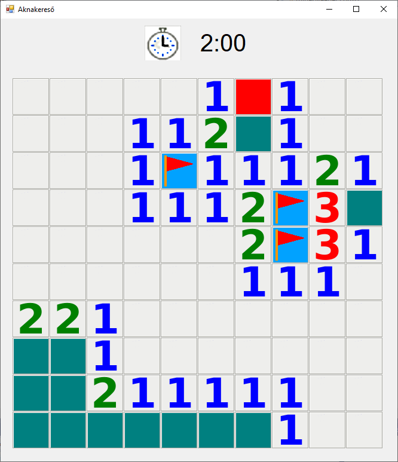

# Aknakereső

A feladat egy aknakereső játék megírása lesz. A játék elkészítéséhez felhasználhatod az [aknakereső_képek.zip](aknakereső_képek.zip) tömörített mappában található képeket.



## 1. Feladat

Hozz létre egy új Windows Forms projektet, tömörítsd ki a zip tartalmát az exe mellé.

## 2. Feladat

Az aknakereső 10x10-es legyen és 10 bombát tartalmazzon. Ehhez először is hozz létre egy `akna_mezo` nevű int típusú 2D tömböt a Form1 osztályba (a függvényeken kívül, globális változóként).
Ebben a 2D tömbben fogjuk tárolni, hogy ha felfednénk az összes mezőt, mi állna ott. Ha a 2D tömb egy cellájában -1 van, akkor ott akna van,
különben meg a cellában lévő szám azt fogja jelenteni, hány szomszédos mezőben van akna.

A Form1 függvényben fogjuk legenerálni az `akna_mezo` tömb értékeit, mivel csak a játék elején akarjuk ezt egyszer megtenni.

Először is generálj 10-szer 2 véletlen számot, mivel minden aknához, egy oszlop és egy sor értéket is akarunk generálni. Az `akna_mezo` megfelelő cellájáiba is írd bele a -1 értéket.
Ha egy olyan cellának választottál ki, ahova már korábban is raktál bombát, akkor sorsolj új véletlen számokat. A végén 10 véletlenül kiválasztott cella értéke legyen -1. 

## 3. Feladat

Ezek után menj végig az `akna_mezo` tömbön, és minden mezőbe (ami nem akna) írd bele, hogy hány szomszédos mezőben van akna. Ne feledd itt az átlós szomszédok is számítanak.

## 4. Feladat
Az akasztófához hasonlóan, itt is programból hozd létre a megjelenő aknamezőket. Minden aknamező egy `PictureBox` legyen, aminek állítsd be megfelelően a `Top`, `Left`, `Width`, `Height` és `Image`
tulajdonságait. Célszerű mind png képeket egyszer a program legelején beolvasni egy változóba és itt csak felhasználni őket, hogy a program gyorsan működjön.

Kezdetben az összes cellában a felfedezetlen aknamezőt jelölő képet jelenítsd meg. Teszteld a program működését!

A hozz létre egy `kepek` nevű 2D tömböt (globális változó legyen), aminek minden cellájába tárold el, az adott mezőben lévő `PicutreBox` vezérlőt, ez a tömb később lesz majd fontos, a kattintások kezelésénél.

## 5. Feladat
Mivel mikor a képekre kattintásra meg akarjuk adni, hogy hogyan változzon az aknamező, hasznos ha tudjuk melyik sorban és oszlopban lévő képet nyomták le,
így eltároljuk a minden `PictureBox`-ban, hogy ő melyik sorba és oszlopba tartozik.

Ehhez hozz létre egy Cella nevű struktúrát, amibe két egész számot lehet megadni: egy sorindexet, és egy oszlopindexet.

Majd minden kép létrehozásakor hozz létre egy új Cella struktúrát az aktuális sor illetve oszlopindexel, és ezt tedd bele a `Tag` mezőjébe a `PictureBox`-nak.
Minden a Windows Formban megjelenő vezérlőnek (Button, PictureBox, Label stb.) van `Tag` mezője. Ebbe a mezőbe tetszőleges adatot belerakhatunk, amit megőriz az adott vezérlő, és később bármikor kiolvashatjuk belőle.
```cs
Cella cella=new Cella(i,j); //i,j az aktuális sor és oszlopindex
pictureBox.Tag=cella;
```
## 6. Feladat
A `PictureBox`-okhoz csatolj hozzá egy függvényt, ami akkor fut le, ha rákattintott a felhasználó a képre.
Itt ki tudod olvasni, hogy melyik sorban és oszlopban lévő mezőre kattintott a felhasználó az alábbi módon:
```
PictureBox clicked_pd=(PictureBox)sender; //hasonlóan az akasztófához
Cella c=(Cella)(clicked_pd.Tag); //Mivel a Tag-ben elveszti, hogy milyen típusú volt a beletöltött adat, vissza kell alakítsuk.
```
Ezek után ellenőrizd, hogy a kép korábban fel lett-e fedve, ha nem akkor hívd meg az `Felfedes` nevű függvényt, amelynek feladata lesz,
hogy felfedje az adott cella tartalmát, illetve, ha nincs az adott cella szomszédságában egyetlen akna sem, akkor fedje fel a szomszédait is.
Hozd is létre a `Felfedes` függvényt:
```cs
void Felfedes(int sor, int oszlop){
    //Az alapján, hogy mi az akna_mezo tömb értékét használd fel a megfelelő kép kiválasztására.
    //A kép beállítását úgy csináld, hogy a kepek tömb megfelelő sor és oszlopában lépvő PictureBox Image tulajdonságát állítod be.
    //Egyenlőre azzal ne foglalkozz, hogy 0 esetén a szomszédokat is felfedje
}
```

## 7. Feladat
A felfedés függvényben, ha az `akna_mezo`-nek adott sorában és oszlopában 0 érték van, akkor az azt jelenti, hogy egyik szomszédjában sincs akna így fel kell fedjük a szomszédjait is.
Ehhez a függvényben minden szomszédos cellára is meg kell hívjuk a felfedés függvényt (itt hasznos, hogy a `kepek` tömbben benne vannak a szomszédos `PictureBox`-ok):
```cs
void Felfedes(int sor, int oszlop){
    //Ha az aknamezőben nem 0-van, akkor állítsd be egyszerűen a képet
    //Ha 0-van:
      //Minden szomszédra, ami még nem lett felfedve:
        Felfedes(szomszed_sora,szomszed_oszlopa);
}
```

Azt ha egy függvényben meghívjuk ugyanazt a függvényt újra (de esetleg más bemeneti paraméterekkel), azt rekurziónak hívjuk.
Ilyenkor arra kell odafigyelni, hogy könnyen megtörténhet, hogy elrontjuk a programot, és a végtelen ciklus mintájára itt végtelenszer hívja meg a függvény önmagát, ekkor a Visual Studio egy StackOverFlow hibát dob.


## 8. Feladat
Ha a játékos bal gombbal kattint akkor szeretnénk hogy felfedje az adott cella tartalmát, ha jobb gombbal kattint akkor csak azt szeretnénk,
ha egy zászlóval megjelölné a cellát, ami újabb jobb gombbal vissza tud vonni (persze csak akkor ha a cella még nem lett felfedve). Valósítsd meg ezt a funkciót!

Azt hogy melyik gombot nyomták le így tudod elérni (a kattintáskezelő függvényben):

```
MouseEventArgs me=(MouseEventArgs)e; //e a bemeneti paraméter, a rendszer adja és csomó hasznos infó benne van a bekövetkezett eseményről.
                                     //Ha az egérgomblenyomással kapcsolatos információkat akarjuk kiolvasni először átt kell alakítsuk.
if(me.Button==MouseButtons.Right){ //Ha jobb egérgombot nyomták le.
  //...
}
//Hasonlóana MouseButtons.Left-t használható balegérgomb lenyomáshoz.
```

## 9. Feladat

Ha a felhasználó balegérgombbal egy aknára kattint legyen vége a játéknak.

## 10. Feladat

A játékot opcionálisan felokosíthatod az alábbi funkciókkal:
 - Ha minden mező fel lett fedve, ahol nincs akna, akkor írja ki a játék, hogy nyertél
 - A játék mérje mennyi ideje játszunk az aktuális aknamezővel.
 - Lehessen a játék elején megadni mekkora (négyzet alakú) aknamezővel akarunk játszani, és, hogy hány akna legyen benne
 - Számolja a játék, hogy hány zászlót raktunk le. Írja, ki hogy ez alapján hány akna "van még hátra".
 - Lehessen segítséget kérni, és akkor felfed a játék egy olyan mezőt ahol nincs akna, de minden játékban csak korlátozott számú segítség legyen.


