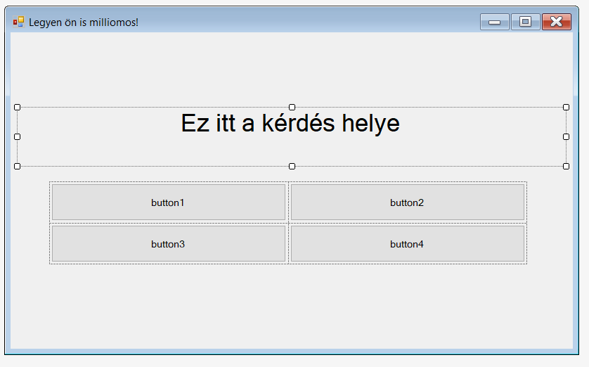
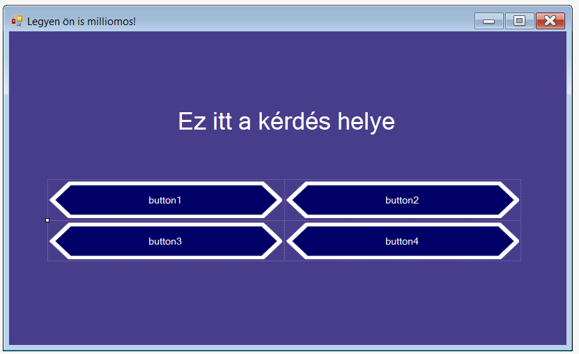

# Legyen ön is milliomos! quizjáték

A feladat egy a híres tv műsorhoz hasonló quizjáték elkészítése lesz. A quiz úgy fog kinézni, hogy kérdéseket kap a játékos,
a kérdésekre négy válaszlehetőség közül kell kiválassza a megfelelőt, de a döntésre csak korlátos idő áll a rendelkezésére.

A játék addig tart amíg vagy elront egy kérdést a játékos, vagy megválaszolja az összes kérdést helyesen.

A feladatsorban nem írom, de szükségesnek látod, akkor nevezd el az egyes grafikus elemeket.

## 1. feladat
Először is állítsd át az ablak nevét "Legyen ön is milliomos!"-ra.

Az ábrán látható módon hoz létre egy labelt, ahova a kérdés szövege fog kerülni, ha a `Autosize` property-t `False`-ra állítod,
akkor át tudod méretezni a labelt, illetve állítsd be, hogy a szöveg középre legyen igazítva. Állítsd be, hogy nagyobb legyen a betűnéret.

Ezután adj hozz egy `TableLayoutPanel`-t az ablakra, méretezd át megfelelően, majd illesz bele négy gombot. Ezek lesznek a válaszlehetőségek.
A gomboknak a `Dock` tulajdonságát, ha `Fill`-re állítod, akkor kitöltik a táblázat megfelelő mezőit.



## 2. feladat

Formázd meg a gombokat, és a hátteret, valami, az ábrán láthatóhoz hasonlóra. Felhasználhatod az ebben a mappában található [löm_hatter.png](löm_hatter.png) fájlt.
A gomboknak kép háttért a `BackgroundImage` property-n keresztül tudsz beállítani. Ezen kívól szükséged lesz a `FlatStyle`, `BorderSize`, `BackgroundImageLayout`
illetve `BackColor` tulajdonságok állítására. A háttérszínt a web fülön látható `Transparent` (átlátszó) színre állítsd.

Illetve állítsd át az ablak háttérszínét, és a betűszíneket.

Próbáld ki az alkalmazást, itt még azt fogod tapasztalni, hogyha a gomb felé vizsed az egeret, és kattintasz vele, akkor nem néz ki szépen.
Ezt úgy tudod kijavítani, ha a `FlatApparance` kategórián belül a megfelelő értékeket átlátszóra állítod.



## 3. feladat

Készíts kérdésbankot. Hozz létre egy txt fájlt szokásosan a bin mappába, a txt fájl az alábbi formátumú legyen:

```
Mikor tört ki 1848-as szabadságharc?
2
március 5.
márcus 15.
február 15.
április 7.
Mi a dihidrogén-monoxid közönséges neve?
...
```

A fájl kérdésblokkokból álljon. A kérdésblokk első sora a kérdés, a második sor tartalmazza, hogy hanyadik válasz a helyes, utána meg a 4 válasz található.
A kérdésblokkok egymás alatt helyezkedjenek el.

Hozz létre a programban egy kérdés struktúrát:
```cs
public struct Kerdes{
  public string szoveg;
  public int helyes_valasz;
  public string[] valaszok;
}
```

Majd készíts beolvas függvényt a Form1 osztályban, ami beolvassa az adatokat egy `Kerdes[]` tömbbe. Itt már nem kell a függvény elé kiírni, hogy `static`.

## 4. feladat

A `From1()` nevű konstruktorban (az `InitializeComponent()` alatt) állítsd be, hogy az első kérdés, illetve annak válaszai jelenjenek meg. (Először ehhez meg kell hívnod a beolvas függvényt).

## 5. feladat

Csináld, meg, hogy amennyiben a helyes válaszra kattint a felhasználó akkor a következő vélasz jelenjen meg.
A legegyszerűbb ha a Form1 osztályban, a függvényeken kívül lévő int-ben eltárolod, hogy aktuálisan hanyadik kérést tölti ki a felhasználó.
Egyenlőre rossz válasz esetén ne történjen semmi.

## 6. feladat
Rossz válasz esetén, a rejtsd el a létrehozott `TableLayoutPanel`-et (`Visible` legyen `false`) a kérdés helyén meg az szerepeljen, hogy 
a játékos vesztett, illetve, hogy hány kérdést tudott megválaszolni.

## 7. feladat

Hozz létre egy Timert. Ezt is a toolboxból tudod a fromra húzni, viszont, mivel a timer az csak a háttérben egy óra, és nem jelenik meg sehol az ablakon,
így létrehozás után a szerkesztőben alul láthatod egy külön ilyen háttérelemeknek fenntartott sávon.

Állítsd be, hogy a timer 1 másodpercenként szóljon. (`Interval` legyen 1000 (ms) ). És állítsd be hogy, egyből elinduljon (`Enabled` legyen `true`).
Majd hozz létre egy label-t ahol a hátralévő idő látszódik.

Ha a timerre duplán kattintasz, akkor létrehoz egy függvényt, amit pontosan 1 másodpercente hívódik meg (ezt állítottuk be).
Ennek a függvénynek a segítségével old be, hogy a label mindig a hátralévő időt mutassa. Illetve azt, hogyha lejár az idő, azt rossz válasznak jelezze.

## 8. feladat
Ha szeretnéd kiegészítheted még a quiz játékot apróbb fejlesztésekkel:
- Pirosan villogjon a label, ha már csak kevés idő van (lehet két timer is a programban)
- Legyen felezés, telefonos segítség, közönségszavazás. (A felezés véletlen két rossz választ rejtsen el,
a telefonos segítség mutassa meg a jó választ, a közönségsegítségnek meg a 70%-a szavazzon a jó válaszra, a maradék 30% meg a rossz válaszok közül, az egyikre.)
Ehhez új labeleket, gombokat is fel kell vegyél...
- Írja ki, hogy hány forintnál jársz, és a kérdések egyre több pénzt érjenek az eredeti játék mintájára.
- Ha egy válasz felé viszed az egered, annak legyen sárga háttere. (Evenetek között van olyan, hogy MouseOver)
