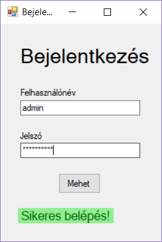

# Bevezetés
Az első winformsos program egy bejelentkező oldal lesz. Az oldalon meg tudod adni a felhasználóneved és a jelszavad majd, ha a mehet gombra kattintasz
kiírja sikeres volt-e a belépés.

Az elkészült projektnek így kellene kinézzen:

## 1. feladat
A designer segítségével készítsd el az oldal kinézetét, és nevezd el az elemeket. (A sikeres bejelentkezés elem még nem kell).

## 2. feladat
Állítsd be, hogy a jelszó karakterek ne látszódjanak (tipp: tulajdonságok fülön keresd).
Illetve azt, hogy a bejelentkezés szöveg 20-as betűmérettel legyen.

## 3. feladat
Hozz létre egy label-t visszajelzes névvel, de ne legyen benne szöveg.
A gombra duplán kattinva hozz létre eseménykezelőt. Ez ellenőrizze, hogy a felhasználónév 'admin', a jelszó is 'admin'-e. 
Ha helyes felhasználónevet, jelszót adott meg, akkor a visszajelzes nevű label szövege legyen "Sikeres belépés", különben sikertelen belépés.

## 4. feladat
Formázd a visszajelzés labelt annak megfelelően sikeres volt-e a belépés. Legyen sötétzöld szöveg világoszöld alapon, ha sikeres volt,
és sötétpiros szöveg világospiros alapon ha sikertelen.

__Tipp__: A grafikus elemek tulajdonságait a program futása közben is tudod állítani. Pl. visszajelzes.ForeColor a betűszínt állítja.

__Tipp__: A színek a Color nevű beépített struktúrában vannak definiálva. Azaz mondjuk kék színhez Color.Blue-t kell használni. 
